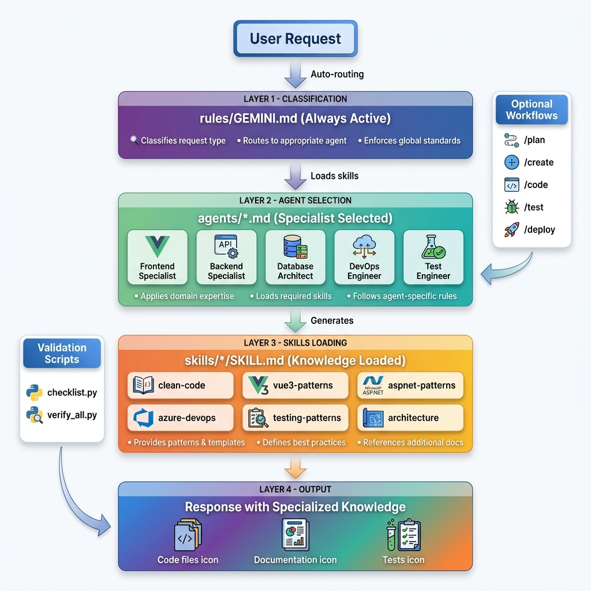
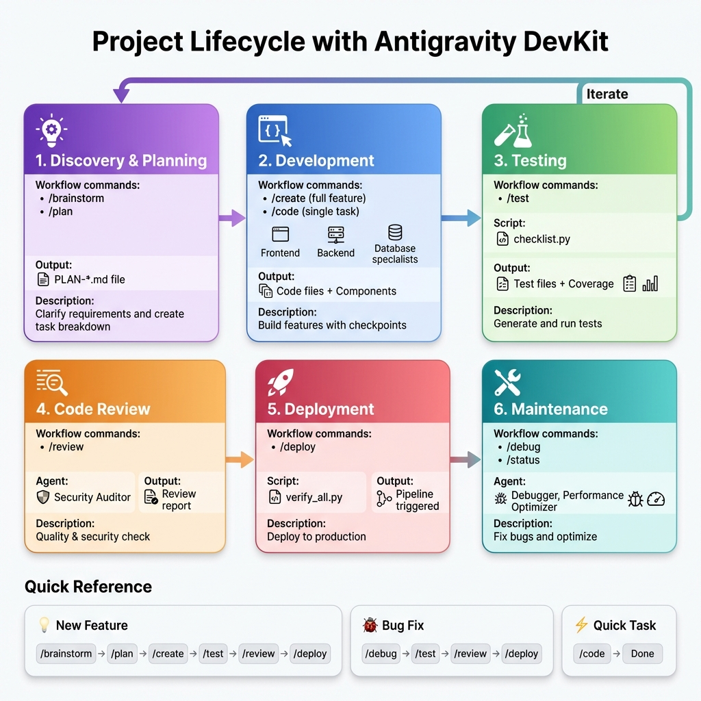

# Antigravity DevKit for Vue3 + ASP.NET + Azure

> A modular AI development toolkit that gives your AI assistant specialized knowledge for Vue3 + ASP.NET Core + Azure development.

---

## What is This Kit?

This kit transforms a general AI assistant into a **specialized development team** with:
- **12 Expert Agents** - AI personas with domain expertise
- **20 Skills** - Reusable knowledge modules
- **10 Workflows** - Slash commands for common tasks
- **Validation Scripts** - Automated quality checks

### Why Use It?

| Without Kit | With Kit |
|-------------|----------|
| Generic AI responses | Specialized expertise for your stack |
| Inconsistent patterns | Enforced best practices |
| Manual quality checks | Automated validation |
| One-shot responses | Multi-step workflows with checkpoints |

---

## Installations

### Option 1: npm (Recommended)

```bash
# One-time use with npx
npx antigravity-devkit init

# OR install globally for frequent use
npm install -g antigravity-devkit
antigravity-devkit init
```

### Option 2: Manual Copy

```bash
# Copy to your project root
cp -r .agent-antigravity .agent
```

### CLI Commands

| Command | Description |
|---------|-------------|
| `antigravity-devkit init` | Install kit to `.agent/` folder |
| `antigravity-devkit init --force` | Overwrite existing `.agent/` |
| `antigravity-devkit update` | Update kit (backs up existing) |
| `antigravity-devkit help` | Show help and usage |

---

## Quick Start

After installation, start using slash commands:

```bash
/plan user authentication feature
/code create login component  
/test generate tests
/deploy to production
```

---

## How It Works



### The Complete Flow

**1. User Request** → Everything starts with your request to the AI assistant.

**2. Classification Layer** (`rules/GEMINI.md`)
   - **Always Active** - This runs before every response
   - Analyzes your request to determine the type (question, code, design, etc.)
   - Routes to the most appropriate specialist agent
   - Enforces global coding standards and best practices

**3. Agent Selection Layer** (`agents/*.md`)
   - The right specialist is automatically selected based on your request
   - Available specialists: Frontend, Backend, Database, DevOps, Test Engineer, and more
   - Each agent brings domain-specific expertise
   - Agents load their required skills for the task

**4. Skills Loading Layer** (`skills/*/SKILL.md`)
   - Agents load relevant knowledge modules
   - Skills include: clean-code, vue3-patterns, aspnet-patterns, azure-devops, testing-patterns, architecture, and more
   - Each skill provides patterns, templates, and best practices
   - Skills can reference additional documentation and examples

**5. Output Generation**
   - AI generates specialized responses using the loaded knowledge
   - Output types: Code files, Documentation, Tests, Configuration, etc.
   - All outputs follow the patterns and standards from the loaded skills

### Supporting Components

**Optional Workflows** (Right Panel)
- Slash commands like `/plan`, `/create`, `/code`, `/test`, `/deploy`
- These trigger pre-defined multi-step procedures
- Can be used to streamline common development tasks

**Validation Scripts** (Left Panel)
- `checklist.py` - Quick validation during development
- `verify_all.py` - Comprehensive checks before deployment
- Automatically run after certain operations or manually triggered

---

## Directory Structure Explained

```
.agent-antigravity/
├── README.md              # You are here
├── ARCHITECTURE.md        # Quick reference for all components
├── rules/                 # GLOBAL RULES (Always Active)
│   └── GEMINI.md
├── agents/                # SPECIALIST AGENTS (Selected per task)
│   └── *.md
├── skills/                # KNOWLEDGE MODULES (Loaded by agents)
│   └── */SKILL.md
├── workflows/             # SLASH COMMANDS (User-triggered)
│   └── *.md
└── scripts/               # VALIDATION TOOLS (Run manually or auto)
    └── *.py
```

---

## Folder Details

### 📁 `rules/` - Global Rules (Always Active)

**What:** Rules that apply to EVERY interaction.

**When Applied:** Automatically, before any response.

**Contains:**
- `GEMINI.md` - Master rules file with:
  - Request classification (question, code, design, etc.)
  - Agent routing logic (which agent handles what)
  - Universal coding standards
  - Human-in-the-loop checkpoints
  - Socratic Gate (ask before assuming)

**Priority:** Highest - these rules override everything else.

```
Rule Priority: GEMINI.md > Agent.md > SKILL.md
```

---

### 📁 `agents/` - Specialist Agents (Selected Per Task)

**What:** AI personas with specialized expertise for specific domains.

**When Applied:** When request matches agent's domain (auto-routed or manually invoked with `@agent-name`).

**How It Works:**
1. Request comes in: "Create a Vue component for user profile"
2. GEMINI.md routes to `frontend-specialist`
3. Agent file is loaded with its skills
4. Response follows agent's patterns and rules

**Available Agents:**

| Agent | Domain | When to Use |
|-------|--------|-------------|
| `orchestrator` | Multi-agent coordination | Complex tasks spanning multiple domains |
| `project-planner` | Discovery, planning | New features, architecture decisions |
| `frontend-specialist` | Vue3, TypeScript | Components, state, UI logic |
| `backend-specialist` | ASP.NET, C# | APIs, services, business logic |
| `database-architect` | SQL Server | Schema design, queries, migrations |
| `devops-engineer` | Azure DevOps, AKS | Pipelines, deployments, infrastructure |
| `security-auditor` | Security, KeyVault | Audits, vulnerability checks |
| `test-engineer` | xUnit, Vitest | Unit tests, integration tests |
| `debugger` | Bug fixing | Root cause analysis, debugging |
| `performance-optimizer` | Grafana, metrics | Performance tuning, monitoring |
| `documentation-writer` | Docs, README | API docs, technical writing |
| `explorer-agent` | Codebase analysis | Understanding existing code |

**Manual Invocation:**
```
@backend-specialist create a user service
@security-auditor review this controller
```

---

### 📁 `skills/` - Knowledge Modules (Loaded by Agents)

**What:** Reusable knowledge packages that agents load for specific tasks.

**When Applied:** When an agent needs specialized knowledge (defined in agent's frontmatter).

**Structure:**
```
skills/
└── skill-name/
    ├── SKILL.md           # Main skill file (required)
    ├── references/        # Templates, examples (optional)
    └── scripts/           # Validation scripts (optional)
```

**How Loading Works:**
```yaml
# In agent file (e.g., backend-specialist.md)
---
skills: clean-code, aspnet-patterns, api-patterns
---
```
When `backend-specialist` is activated, these skills are loaded.

**Available Skills by Category:**

| Category | Skills | Purpose |
|----------|--------|---------|
| **Core** | `clean-code`, `architecture` | Universal coding standards |
| **Planning** | `brainstorming`, `plan-writing` | Discovery and task breakdown |
| **Frontend** | `vue3-patterns`, `vitest-testing` | Vue3 + Tailwind patterns |
| **UI/UX Design** | `frontend-design` | Design thinking, UX psychology, anti-AI-slop, animations, Tailwind theming |
| **Backend** | `aspnet-patterns`, `csharp-patterns`, `api-patterns` | ASP.NET best practices |
| **Database** | `sqlserver-design` | SQL Server patterns |
| **Azure** | `azure-devops`, `azure-aks`, `azure-keyvault` | Azure services |
| **DevOps** | `gitops-patterns`, `grafana-logging` | CI/CD and monitoring |
| **Testing** | `xunit-testing`, `testing-patterns` | Test strategies |
| **Security** | `vulnerability-scanner` | Security checks |
| **Industry** | `english-education` | Domain-specific (customizable) |

---

### 📁 `workflows/` - Slash Commands (User-Triggered)

**What:** Pre-defined procedures for common development tasks.

**When Applied:** When user types a slash command (e.g., `/plan`, `/code`).

**Available Commands:**

| Command | Purpose | Output |
|---------|---------|--------|
| `/brainstorm` | Clarify requirements | Questions → Understanding |
| `/plan` | Create project plan | `docs/PLAN-{slug}.md` file |
| `/create` | Build complete feature | Code + Tests + Verification |
| `/code` | Generate specific code | Code for one task |
| `/test` | Generate tests | Test files |
| `/debug` | Fix bugs | Root cause → Fix → Verify |
| `/review` | Code review | Review report |
| `/deploy` | Trigger deployment | Pipeline trigger |
| `/status` | Check project health | Status report |
| `/orchestrate` | Multi-agent task | Coordinated execution |

**Choosing the Right Command:**

| Your Situation | Use This | Why |
|----------------|----------|-----|
| "I have a vague idea" | `/brainstorm` | Clarify before building |
| "I know what to build" | `/plan` | Create task breakdown |
| "I have a plan, build it all" | `/create` | Full feature with checkpoints |
| "Just this one thing" | `/code` | Quick, focused output |
| "Something is broken" | `/debug` | Systematic fix |
| "Is this code good?" | `/review` | Quality check |
| "Ready to ship" | `/deploy` | Trigger pipeline |

**Key Differences:**

| `/create` | `/code` |
|-----------|---------|
| Full feature (many files) | Single task (few files) |
| Follows a plan file | No plan needed |
| Multiple agents | One specialist |
| Checkpoints for approval | Quick execution |

| `/brainstorm` | `/plan` |
|---------------|---------|
| Discover requirements | Define tasks |
| Output: understanding | Output: PLAN-*.md file |
| Use when unclear | Use when clear |

---

### 📁 `scripts/` - Validation Tools (Manual or Auto)

**What:** Python scripts for automated quality checks.

**When Applied:** 
- Manually: Run from terminal
- Auto: Agents may run after completing tasks

**Available Scripts:**

| Script | Purpose | When to Use |
|--------|---------|-------------|
| `checklist.py` | Quick validation (lint, types, tests) | During development, pre-commit |
| `verify_all.py` | Comprehensive check (all validations) | Before deployment, releases |

**Usage:**
```bash
# Quick check during development
python .agent/scripts/checklist.py .

# Full verification before deploy
python .agent/scripts/verify_all.py . --url http://localhost:3000
```

**What They Check:**
- Security (secrets, vulnerabilities)
- Code quality (lint, types)
- Tests (pass/fail, coverage)
- Build (compiles successfully)
- Dependencies (outdated, vulnerable)

---

## Project Lifecycle



### Understanding the Development Phases

The antigravity-dev-kit supports your entire development lifecycle with specialized workflows for each phase:

#### **Phase 1: Discovery & Planning** 🔍
**Workflows:** `/brainstorm`, `/plan`

Start here when you have a new feature idea or requirement. The kit helps you:
- Clarify vague requirements through strategic questions
- Create detailed task breakdowns
- Generate a `PLAN-*.md` file for structured implementation

**When to use:**
- New feature requests
- Complex requirements that need clarification
- Architecture decisions

---

#### **Phase 2: Development** 💻
**Workflows:** `/create` (full feature), `/code` (single task)

Build your features with specialized agents:
- **Frontend Specialist** - Vue3 components and UI
- **Backend Specialist** - ASP.NET APIs and services
- **Database Architect** - SQL schema and queries

**Key features:**
- Checkpoints for human approval
- Follows your plan file
- Multi-agent coordination for complex features

---

#### **Phase 3: Testing** 🧪
**Workflows:** `/test`  
**Scripts:** `checklist.py`

Generate comprehensive tests:
- Unit tests (xUnit for backend, Vitest for frontend)
- Integration tests
- Test coverage reports

**Automated checks:**
- Linting and type checking
- Code quality validation
- Test execution

---

#### **Phase 4: Code Review** 🔎
**Workflows:** `/review`  
**Agent:** Security Auditor

Get automated code reviews covering:
- Security vulnerabilities
- Code quality issues
- Best practice violations
- Performance concerns

**Output:** Detailed review report with actionable recommendations

---

#### **Phase 5: Deployment** 🚀
**Workflows:** `/deploy`  
**Scripts:** `verify_all.py`

Deploy with confidence:
- Comprehensive pre-deployment validation
- Azure DevOps pipeline trigger
- Deployment verification

**Checks before deploy:**
- All tests passing
- No security vulnerabilities
- Build successful
- Dependencies up to date

---

#### **Phase 6: Maintenance** 🔧
**Workflows:** `/debug`, `/status`  
**Agents:** Debugger, Performance Optimizer

Keep your application healthy:
- Root cause analysis for bugs
- Performance optimization
- System health monitoring
- Quick fixes and patches

**Continuous improvement:**
- Monitor application metrics
- Optimize slow queries
- Fix production issues
- Iterate back to Phase 1 for new features

---

### Quick Reference: Common Scenarios

| Scenario | Workflow Path | Duration |
|----------|--------------|----------|
| **New Feature** | `/brainstorm` → `/plan` → `/create` → `/test` → `/review` → `/deploy` | Full cycle |
| **Bug Fix** | `/debug` → `/test` → `/review` → `/deploy` | Fast track |
| **Quick Task** | `/code` → Done | Immediate |

---

## Typical Workflows

### Building a New Feature

```
1. /brainstorm user authentication
   → AI asks clarifying questions
   → You answer and confirm understanding

2. /plan user authentication
   → Creates docs/PLAN-user-auth.md
   → Review and approve the plan

3. /create user authentication
   → AI follows the plan
   → Builds backend → [Checkpoint] → Builds frontend → [Checkpoint]
   → Generates tests → [Checkpoint]

4. /review
   → Security and quality check
   → Approve for deployment

5. /deploy
   → Triggers Azure DevOps pipeline
```

### Quick Single Task

```
/code create a Vue component for user avatar
→ Routes to frontend-specialist
→ Generates component with TypeScript
→ Done
```

### Fixing a Bug

```
/debug login fails with 401 error
→ AI investigates root cause
→ Proposes fix
→ You approve
→ Fix applied and tested
```

---

## Customization

### Adding Your Own Skill

1. Create folder: `skills/your-skill/`
2. Add `SKILL.md` with frontmatter:
```yaml
---
name: your-skill
description: What this skill does
---
# Your Skill Name

[Your skill content - patterns, rules, templates]
```
3. Reference it in an agent's skills list

### Modifying an Agent

Edit the agent's `.md` file to:
- Change which skills it loads
- Modify its rules and patterns
- Update its domain expertise

### Adding Industry-Specific Knowledge

Use `skills/english-education/` as a template:
```
skills/your-industry/
├── SKILL.md              # Main skill file
├── references/           # Industry templates
│   ├── template-1.md
│   └── template-2.md
└── scripts/              # Industry validators
    └── validator.py
```

---

## Tech Stack

| Layer | Technology |
|-------|------------|
| Frontend | Vue3, TypeScript, Pinia, Vitest |
| Backend | ASP.NET Core, C#, xUnit |
| Database | SQL Server |
| Cloud | Azure DevOps, AKS, KeyVault |
| Observability | Grafana |
| GitOps | ArgoCD/Flux pattern |

---

## File Reference

| File | Purpose |
|------|---------|
| `ARCHITECTURE.md` | Quick reference table of all components |
| `rules/GEMINI.md` | Master rules (always active) |
| `agents/*.md` | Specialist personas |
| `skills/*/SKILL.md` | Knowledge modules |
| `workflows/*.md` | Slash command definitions |
| `scripts/*.py` | Validation scripts |

---

## License

MIT
